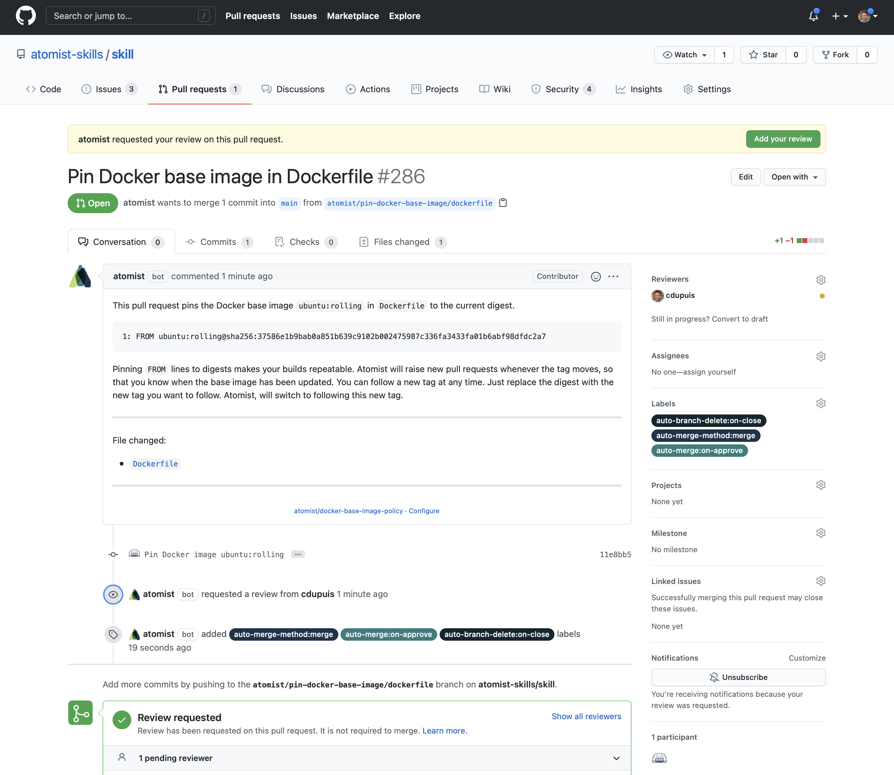

The Docker Base Image Policy allows you to create repeatable Docker builds by
pinning your Docker base images and `FROM` instructions to image digests instead
of mutable image tags.

# Docker base image pinning pull request on GitHub

