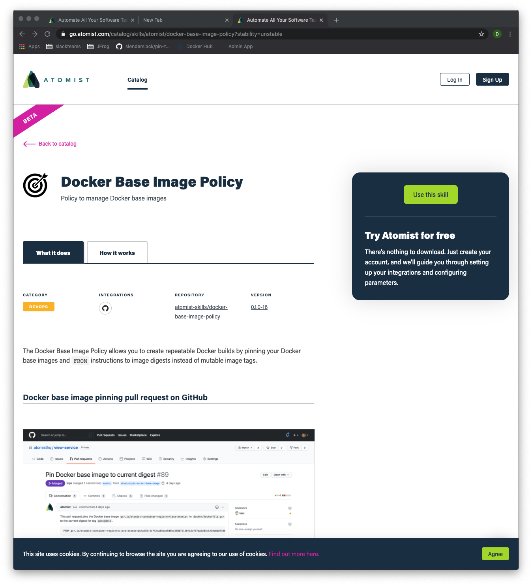
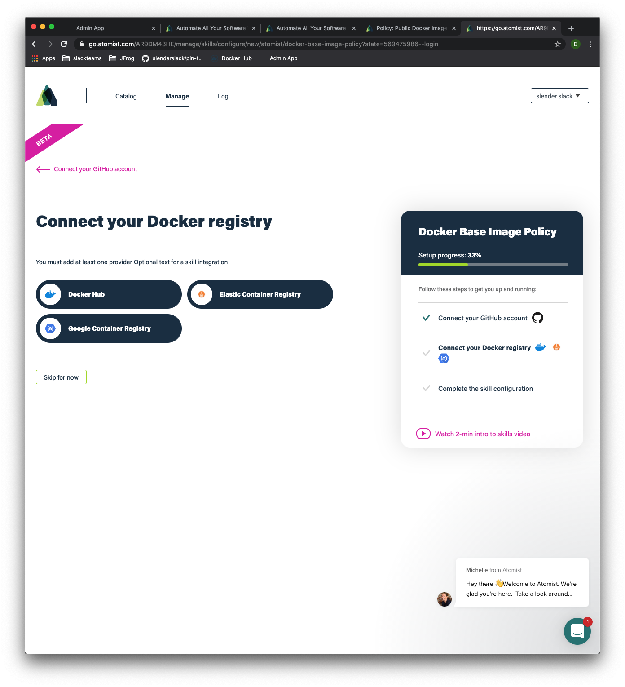
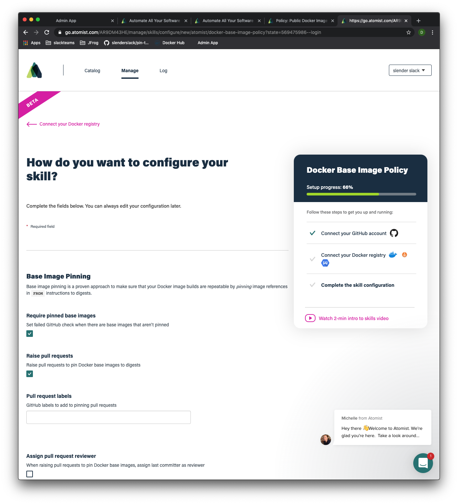
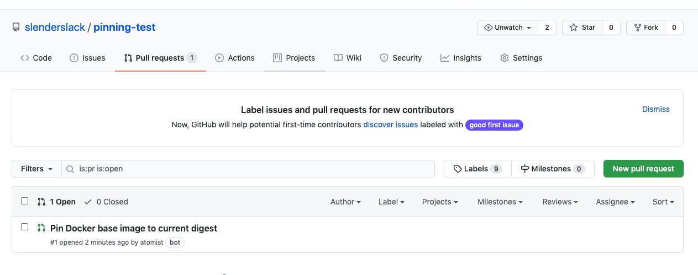
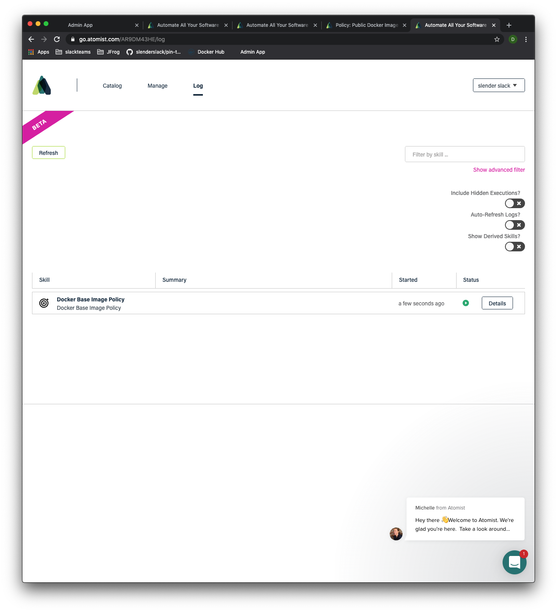
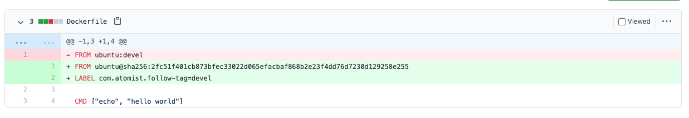

## Before you get started

Connect and configure these integrations:

1.  [**GitHub**][github] _(required)_
2.  [**Docker Hub**][dockerhub] _(required for namespaced registries on
    DockerHub)_
3.  [**Slack**][slack] or [**Microsoft Teams**][msteams] _(optional)_

[github]: https://go.atomist.com/catalog/integration/github "GitHub Integration"
[slack]: https://go.atomist.com/catalog/integration/slack "Slack Integration"
[dockerhub]:
    https://go.atomist.com/catalog/integration/dockerhub
    "Dockerhub Integration"
[msteams]:
    https://go.atomist.com/catalog/integration/microsoft-teams
    "Microsoft Teams Integration"

Achieves repeatable docker builds by switching Dockerfile `FROM` instructions to
reference images by manifest (instead of by tag). Watches for updates to Tags
and offers Pull Requests to developers when a new base image is available.

### Step 1: Enable policy for public images stored on Docker Hub

This policy watches GitHub pushes for Dockerfiles with `FROM` instructions that
reference _public_ Docker Image Tags. The policy will raise a PR to convert any
Tag to a Docker digest. It will then continue to raise PRs whenever that Tag
moves, even if the Dockerfile author switches the Dockerfile to a different Tag.

1. Start by enabling the
   [Docker Base Image Policy](https://go.atomist.com/catalog/skills/atomist/docker-base-image-policy).

Click the Green button "Use this skill" on the
[Skill Page](https://go.atomist.com/catalog/skills/atomist/docker-base-image-policy).



2.  Enable the Skill. This will take the user through the GitHub App
    integration, and selection of a Docker Registry.

To see a PR that pins to an image digest in a public Docker Hub repo, we won't
need to configure an integration to a private registry. However, we will need to
come back to this when we start tracking updates to tags in private registries.
For now, you can use the "skip" button to move past this step.



3.  The Docker Base Image Policy configuration screen requires that you first
    configure the policy. There are some options to customize how `FROM` line
    tags are managed. Leave the default settings and simply scroll to the bottom
    of this screen and click the "Enable Skill" button.



4.  Your policy is now watching the set of Repos that you have selected in the
    Atomist GitHub app. To see this in action, create a new Repo with a simple
    Dockerfile. For example, create an empty Repo in your test org called
    `pinning-test` by running:

```bash
$ export ORG=<replace with you org name>
$ mkdir pinning-test && cd pinning-test && git init
$ cat << END > Dockerfile
FROM ubuntu:devel
ARG REVISION
ARG SOURCE
LABEL org.opencontainers.image.revision=\$REVISION
LABEL org.opencontainers.image.source=\$SOURCE
CMD ["echo", "hello world"]
END
$ git add Dockerfile
$ git commit -m "initial commit"
$ git remote add origin git@github.com:$ORG/pinning-test.git
$ git push -u origin master
```

The Atomist GitHub application will detect this push, and the policy will then
create a Pull Request to pin your FROM line.



You'll also see that the policy ran in the "log" tab of your workspace.



Drill in to the Pull Request and note that Atomist has "pinned" the `FROM`
clause to the current digest:



If you build using this version of the Dockerfile, you'll always get the same
base image. If the `devel` tag moves, this repo will receive another pull
request (ubuntu is a public docker registry). This subsequent pull request makes
developers aware that the base image has been updated. In a subsequent step,
we'll also talk about how we detect which vulnerabilities will be removed by
merging this Pull Request.
